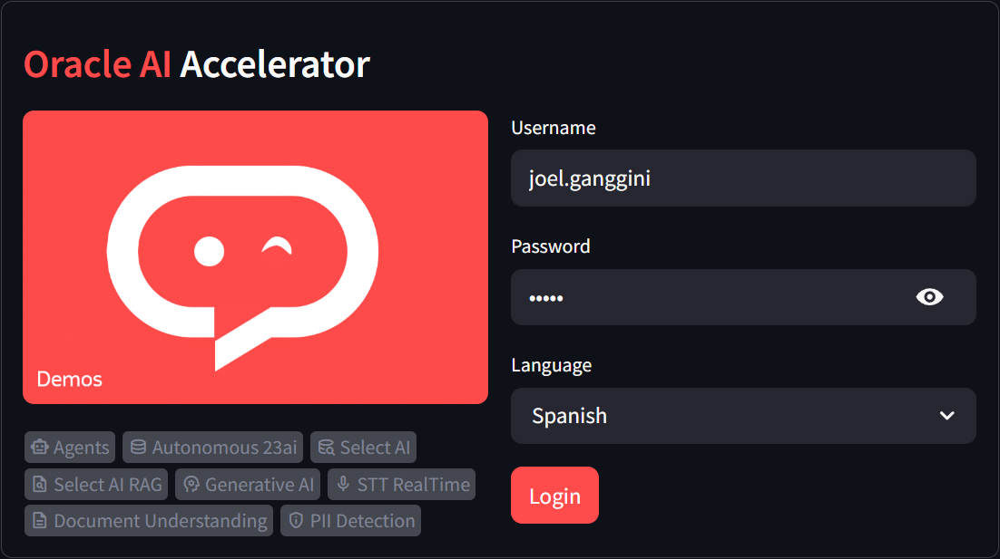

[![Issues][issues-shield]][issues-url]
[![LinkedIn][linkedin-shield]][linkedin-url]

<!-- Intro -->
 

  <h1 style="font-size:40px; font-bload"><b style="color:#ec4b42">Oracle AI</b> Acelerator 2.0.1</h1>
  
  <a style="font-size:large;" href="/src/">👨🏽‍💻 Explore the Code »</a>
   
  <a href="https://youtube.com/playlist?list=PLMUWTQHw13gbqqVHaCid3gUBIlvfVKaBu&si=BphBR3Hq2y_EGmnF">🎬 View Demo</a>
  ·
  <a href="https://github.com/jganggini/oci-functions/issues">💣 Report Bug</a>
  ·
  <a href="https://github.com/jganggini/oci-functions/pulls">🚀 Request Feature</a>

  

## 📄 Contents

Esta guía es modular: puedes seguir cada sección de forma independiente, sin necesidad de un orden específico.

La única condición es contar con una cuenta activa en Oracle Cloud.

  </img>

<!-- TABLE OF CONTENTS -->

  <ol>
    <li><a href="docs/1-create-and-activate-an-oracle-cloud-account.md">Create and Activate an Oracle Cloud Account</a></li>
    <li><a href="docs/2-creating-and-preparing-services-for-the-project.md">Creating and Preparing Services for the Project</a></li>
    <li><a href="docs/3-instance-or-local-machine-configuration-windows.md">Instance or Local Machine Configuration (Windows)</a></li>
    <li><a href="docs/4-automated-deployment-on-oci-resource-manager-linux.md">Automated Deployment on OCI Resource Manager (Linux)</a></li>
    <li><a href="docs/5-data-model-documentation.md">Data Model Documentation</a></li>
  </ol>

## 📄 Project Description

Oracle AI Accelerator es una solución integral que permite gestionar y analizar datos provenientes de múltiples fuentes como documentos, imágenes, archivos de audio y texto, mediante módulos de inteligencia artificial desplegados sobre Oracle Autonomous Database 23ai. Utiliza servicios avanzados de OCI como Generative AI, Document Understanding y Speech para aplicar procesamiento de lenguaje natural, extracción de texto, transcripción en tiempo real y análisis semántico. Toda la información es estructurada, almacenada y consultada desde una base vectorial en Oracle 23ai, lo que habilita búsquedas inteligentes, análisis de similitud y flujos de trabajo asistidos por agentes IA configurables, con control de acceso y compartición entre usuarios.

## 🎯 Use Cases
  * Análisis de documentos legales o médicos con detección automática de entidades sensibles.
  * Transcripción en tiempo real de entrevistas o llamadas de soporte.
  * Clasificación y comprensión automática de documentos escaneados.
  * Recuperación de información basada en embeddings semánticos para sistemas de búsqueda tipo RAG (Retrieval-Augmented Generation).

## 🚀 Architecture

Esta arquitectura procesa entradas como texto, audio, imágenes y documentos mediante servicios de inteligencia artificial para extraer, indexar y generar respuestas. Utiliza Oracle Autonomous Database 23ai, almacenamiento vectorial y modelos generativos integrados en una interfaz con Streamlit.

  </img>

## 📚 Development References with Python and Oracle

- [**Oracle Cloud Infrastructure Python SDK**](https://github.com/oracle/oci-python-sdk)  
  Repositorio oficial con ejemplos y documentación del SDK de Oracle Cloud Infrastructure para trabajar con servicios como Object Storage, IAM, Database, entre otros.

- [**Conexión a Oracle Database con `oracledb`**](https://python-oracledb.readthedocs.io/en/latest/user_guide/connection_handling.html)  
  Guía oficial para conectar aplicaciones Python a bases de datos Oracle mediante el módulo `oracledb`, incluyendo uso de wallets, conexiones con Autonomous Database y manejo eficiente de sesiones.

- [**ObjectStorageClient - API Reference**](https://oracle-cloud-infrastructure-python-sdk.readthedocs.io/en/latest/api/object_storage/client/oci.object_storage.ObjectStorageClient.html)  
  Documentación de la clase cliente para gestionar objetos y buckets en OCI Object Storage desde Python.

- [**OCI Document Understanding SDK**](https://www.ateam-oracle.com/post/using-oci-document-understanding-sdk-python-functions-document-classification-key-value-extraction)  
  Ejemplos y guía de uso del SDK de Document Understanding para clasificación de documentos, extracción de claves y análisis estructurado de documentos escaneados.

- [**OCI Speech Realtime SDK**](https://github.com/oracle/oci-ai-speech-realtime-python-sdk)  
  SDK oficial para capturar, enviar y transcribir audio en tiempo real con el servicio OCI Speech, ideal para aplicaciones de reconocimiento de voz en vivo.

- [**DBMS_VECTOR_CHAIN para embeddings y chunking**](https://docs.oracle.com/en/database/oracle/oracle-database/23/arpls/dbms_vector_chain1.html)  
  Este paquete PL/SQL permite aplicar operaciones avanzadas con Oracle AI Vector Search, como segmentación de texto (chunking), generación de embeddings, y procesamiento semántico para búsqueda por similitud o híbrida.

- [**DBMS_CLOUD_AI para integración con LLMs (Select AI)**](https://docs.oracle.com/en/database/oracle/oracle-database/23/arpls/dbms_cloud_ai1.html)  
  Paquete PL/SQL que facilita la interacción con modelos de lenguaje natural (LLMs) directamente desde SQL y PL/SQL. Permite generar, explicar y ejecutar consultas a partir de prompts, así como integrarse con múltiples proveedores de IA.

- [**Ejemplo: Configurar Select AI con RAG y GenAI**](https://docs.oracle.com/en-us/iaas/autonomous-database-serverless/doc/select-ai-examples.html#ADBSB-GUID-2FBD7DDB-CAC3-47AF-AB66-17F44C2ADAA4)  
  Tutorial paso a paso para configurar credenciales, conectividad y búsqueda vectorial con integración entre Oracle Autonomous Database, Select AI y GentAI (RAG: Retrieval-Augmented Generation).

- [**LangChain + OCI Generative AI**](https://python.langchain.com/docs/integrations/text_embedding/oci_generative_ai/)  
  Integración nativa de LangChain con los modelos de Oracle Generative AI para realizar embeddings y consultas semánticas sobre texto de manera eficiente desde flujos de procesamiento Python.

---

<!-- MARKDOWN LINKS & IMAGES -->
<!-- https://www.markdownguide.org/basic-syntax/#reference-style-links -->
[issues-shield]: https://img.shields.io/github/issues/othneildrew/Best-README-Template.svg?style=for-the-badge
[issues-url]: https://github.com/jganggini/oci-functions/issues
[linkedin-shield]: https://img.shields.io/badge/-LinkedIn-black.svg?style=for-the-badge&logo=linkedin&colorB=555
[linkedin-url]: https://www.linkedin.com/in/jganggini/